<p align="center">
  
</p>

<p align="center">
  A comprehensive Flutter scheduling calendar — 13 views, companion booking widgets, multi-resource scheduling, drag & drop, RRULE recurrence, iCalendar import/export.
  <br/>
  <strong>Widget-layer only.</strong> No Material or Cupertino dependency.
</p>

<p align="center">
  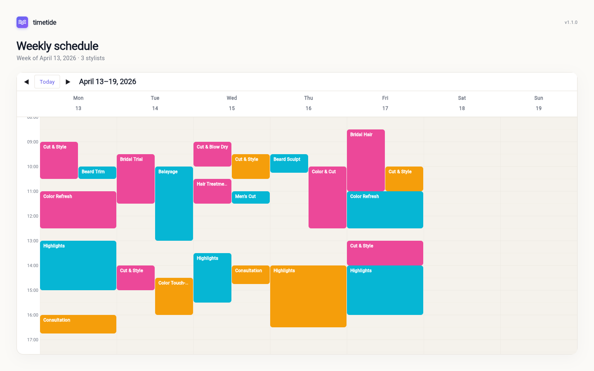
</p>

## Installation

Add to your `pubspec.yaml`:

```yaml
dependencies:
  timetide: ^1.1.1
```

Then run:

```bash
flutter pub get
```

## Quick Start

```dart
import 'package:timetide/timetide.dart';

final datasource = TideInMemoryDatasource(
  events: [
    TideEvent(
      id: '1',
      subject: 'Team Meeting',
      startTime: DateTime(2026, 3, 20, 10, 0),
      endTime: DateTime(2026, 3, 20, 11, 0),
    ),
  ],
);

TideCalendar(
  datasource: datasource,
  initialView: TideView.week,
)
```

## Theming · light & dark out of the box

`TideThemeData` exposes 60+ visual properties. Two examples below — the same week, two different themes:

<p align="center">
  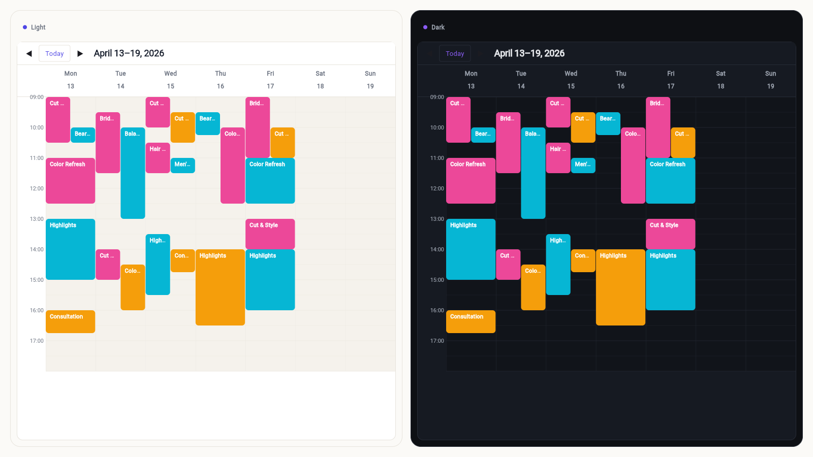
</p>

```dart
TideTheme(
  data: TideThemeData(
    primaryColor: Color(0xFF8B5CF6),
    eventBorderRadius: BorderRadius.circular(8),
    backgroundColor: Color(0xFF0E1014),
  ),
  child: TideCalendar(datasource: datasource),
)
```

## Features

### 13 Calendar Views

| View | Class | Description |
|------|-------|-------------|
| Day | `TideDayView` | Single day, vertical time axis |
| Week | `TideWeekView` | 7-column week layout |
| Work Week | `TideWorkWeekView` | Monday through Friday |
| Month | `TideMonthView` | Grid with event indicators |
| Schedule | `TideScheduleView` | Scrollable agenda list |
| Timeline Day | `TideTimelineDayView` | Day + horizontal resources |
| Timeline Week | `TideTimelineWeekView` | Week + horizontal resources |
| Timeline Work Week | `TideTimelineWorkWeekView` | Work week + resources |
| Timeline Month | `TideTimelineMonthView` | Month + resources |
| Multi-Week | `TideMultiWeekView` | Configurable N-week view |
| Year | `TideYearView` | 12-month overview |
| Resource Day | `TideResourceDayView` | Vertical time axis with side-by-side resource columns |
| Resource Week | `TideResourceWeekView` | Week with day sub-columns per resource, two-level headers |

<p align="center">
  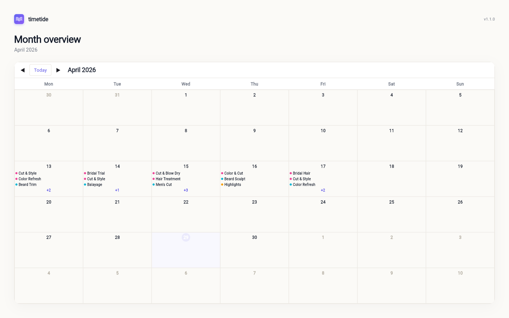
</p>

### Multi-Resource Scheduling

Assign events to rooms, people, or equipment with `TideResource`. Timeline views display resources as rows with synchronized scrolling. Resource Day and Resource Week views place each resource in its own column, making it easy to compare schedules at a glance.

<p align="center">
  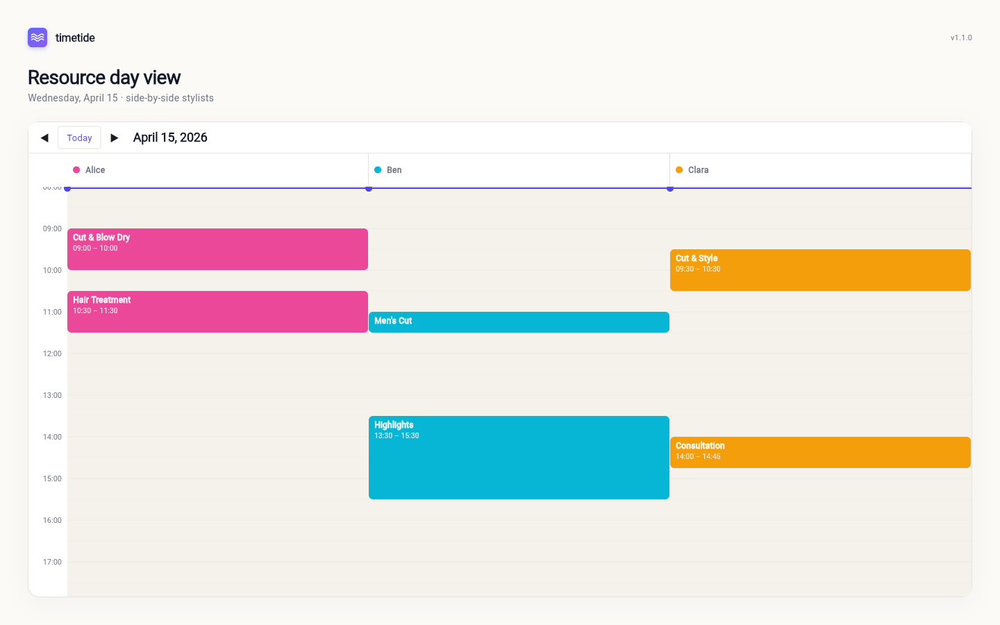
</p>

#### Resource Views

Use `TideView.resourceDay` or `TideView.resourceWeek` to display all resources side by side, each with an avatar and name header. This is ideal for use cases such as a salon owner reviewing all employees' appointments simultaneously.

```dart
final resources = [
  TideResource(id: 'alice', name: 'Alice', avatarUrl: 'https://example.com/alice.jpg'),
  TideResource(id: 'bob', name: 'Bob', avatarUrl: 'https://example.com/bob.jpg'),
];

final datasource = TideInMemoryDatasource(
  events: [
    TideEvent(
      id: '1',
      subject: 'Cut & Colour',
      startTime: DateTime(2026, 3, 20, 10, 0),
      endTime: DateTime(2026, 3, 20, 11, 30),
      resourceId: 'alice',
    ),
  ],
  resources: resources,
);

TideCalendar(
  datasource: datasource,
  initialView: TideView.resourceDay,
)
```

### Drag & Drop

Move and resize events with fully end-to-end custom gesture handling. Supported across all 7 time-based views (day, week, work week, timeline day, timeline week, timeline work week, resource day, resource week):
- Drag to reschedule — long-press on mobile, click-and-drag on desktop
- Cross-resource drag changes `resourceId` automatically
- Resize start/end times by dragging event edges
- Auto-scroll when dragging near viewport edges
- Snap to configurable time-grid slots
- Live conflict detection during drag
- External drag-in from a sidebar or outside the calendar via `TideExternalDragScope`

### RRULE Recurrence

Built-in RFC 5545 RRULE parser, generator, and lazy occurrence engine:

```dart
final rule = TideRecurrence.parse('RRULE:FREQ=WEEKLY;BYDAY=MO,WE,FR');
final dates = rule!.occurrences(start: DateTime(2026, 3, 1));
final desc = rule.describe(locale: 'en'); // "Every week on Monday, Wednesday, Friday"
```

### Visual Recurrence Editor

`TideRecurrenceEditor` provides a fully custom RRULE builder widget with live occurrence preview — no Material widgets required.

<p align="center">
  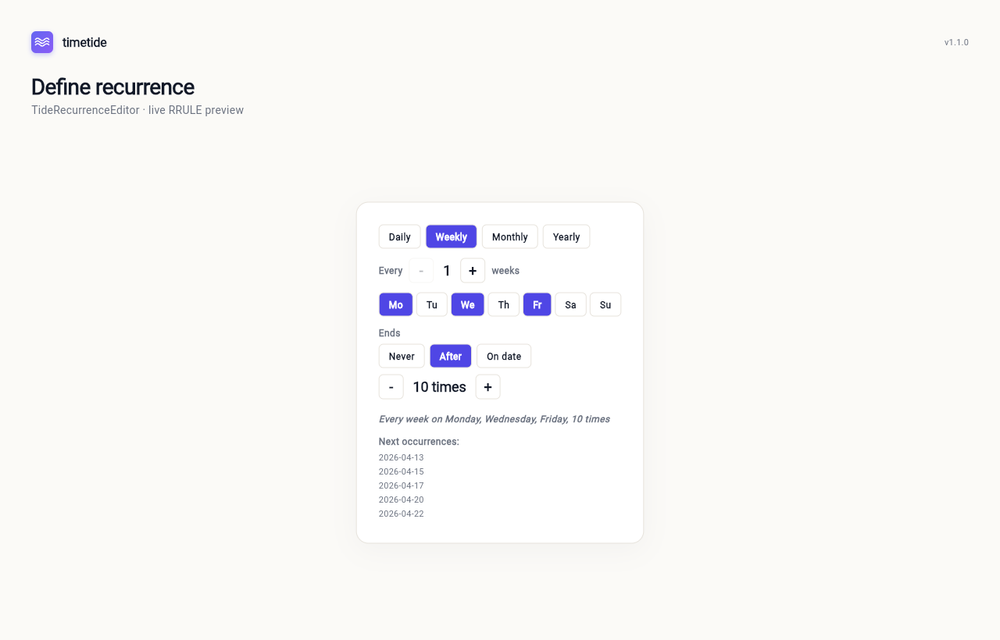
</p>

### iCalendar Export/Import

Export events to `.ics` format and import iCalendar files back into the datasource. Full RFC 5545 compliance.

### Custom Theming

`TideThemeData` provides 60+ properties for colors, typography, spacing, and more. Inject via `TideTheme` (InheritedWidget):

```dart
TideTheme(
  data: TideThemeData(
    primaryColor: Color(0xFF6200EE),
    eventBorderRadius: BorderRadius.circular(8),
  ),
  child: TideCalendar(datasource: datasource),
)
```

### Localization

Built-in English and German support via `TideLocalizations`. Add custom locales by creating a `TideLocalizations` instance.

### Responsive Layout

`TideAdaptiveLayout` + `TideBreakpoints` automatically switch between mobile, tablet, and desktop layouts. The same widgets adapt seamlessly:

<p align="center">
  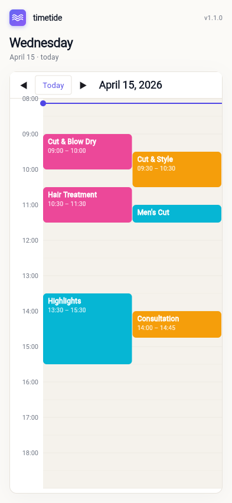
  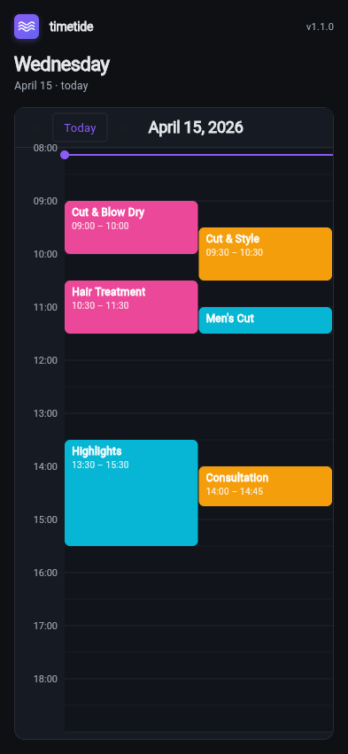
  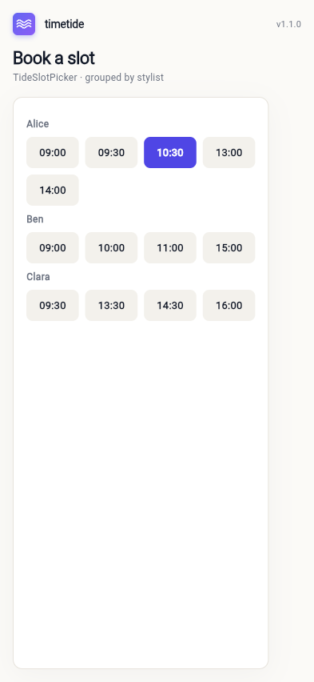
</p>

### Context Menu & Tooltip

Design-agnostic `TideContextMenu` (right-click/long-press) and `TideTooltip` (hover/long-press) — all custom, no Material.

### Companion Widgets

Scheduling companion widgets for booking flows and shift planning — designed to work alongside or independently of the main calendar:

#### TideDateStrip

Horizontal scrollable date picker strip:

<p align="center">
  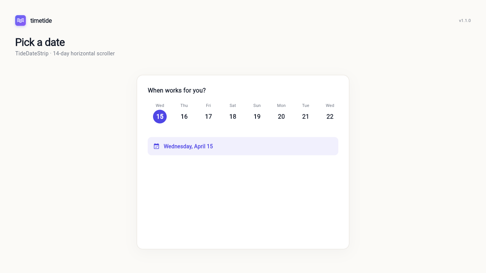
</p>

```dart
TideDateStrip(
  selectedDate: DateTime.now(),
  onDateSelected: (date) => print('Selected: $date'),
  dayCount: 14,
  showTodayIndicator: true,
)
```

#### TideSlotPicker

Time slot selection with optional resource grouping:

<p align="center">
  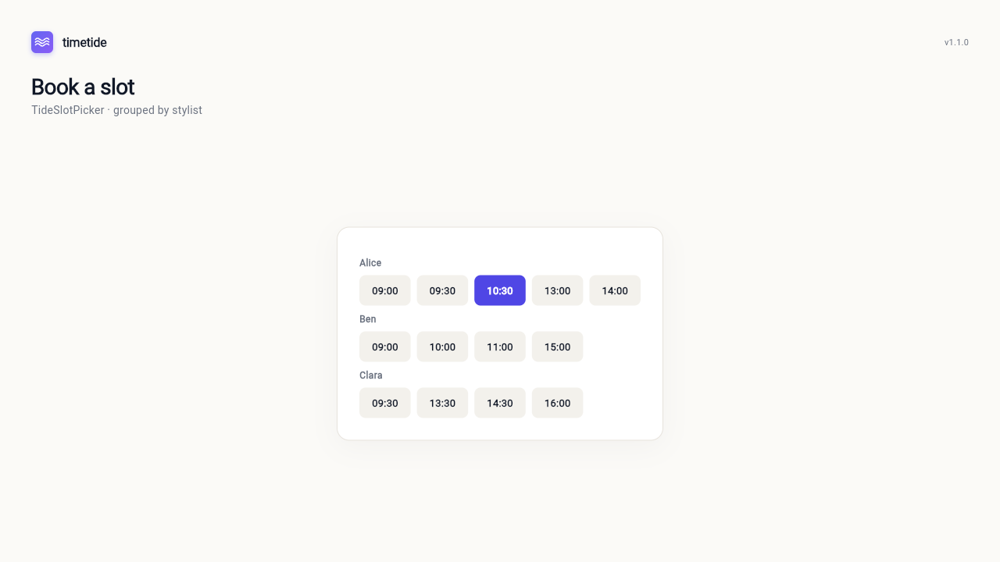
</p>

```dart
TideSlotPicker(
  slots: [
    TideSlot(id: '1', startTime: DateTime(2026, 4, 12, 9, 0), endTime: DateTime(2026, 4, 12, 9, 30), resourceName: 'Alice'),
    TideSlot(id: '2', startTime: DateTime(2026, 4, 12, 10, 0), endTime: DateTime(2026, 4, 12, 10, 30), resourceName: 'Bob'),
  ],
  onSlotSelected: (slot) => print('Selected: ${slot.id}'),
  groupByResource: true,
)
```

#### TideTemplateEditor

Weekly shift/schedule template editor with drag-to-create and resize:

<p align="center">
  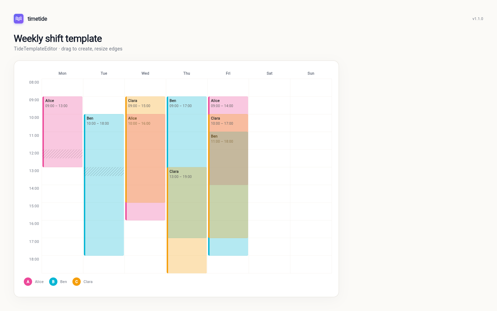
</p>

```dart
TideTemplateEditor(
  resources: myResources,
  slots: myTemplateSlots,
  onSlotCreated: (slot) => print('Created: ${slot.id}'),
  onSlotUpdated: (slot) => print('Updated: ${slot.id}'),
  onSlotDeleted: (slot) => print('Deleted: ${slot.id}'),
  startHour: 7,
  endHour: 21,
)
```

#### TideShiftPlanner

Companion widget for week-based shift scheduling — sidebar of staff plus a 7-column week grid with drag-and-drop shift creation:

```dart
final controller = TideShiftPlannerController();

TideShiftPlanner(
  resources: staff,
  events: shifts,
  weekStart: controller.currentWeekStart,
  controller: controller,
  closedDaysOfWeek: const {DateTime.sunday},
  onShiftCreated: (event) => setState(() => shifts.add(event)),
)
```

Pair it with `TideKwBadge` to render the ISO-8601 calendar-week label inside any toolbar. Switch `dragMode` to `ShiftDragMode.promptForTime` together with a `shiftPromptBuilder` to surface a custom edit dialog before committing the new shift. For bulk operations call `controller.copyPreviousWeek()`, `controller.generateMonthFromWeek(...)`, or `controller.generateRangeFromWeek(...)`; these are pure functions returning fresh `TideEvent`s for the caller to commit.

See [`docs/14_SHIFT_PLANNER.md`](docs/14_SHIFT_PLANNER.md) for the full spec.

## Architecture

- **Widget-layer only**: `flutter/widgets.dart` + `gestures.dart` + `services.dart` + `rendering.dart` + `foundation.dart`
- **Monolithic package**: All 13 views in a single package. Tree-shaking removes unused code.
- **Custom RRULE engine**: RFC 5545 parser with lazy `sync*` occurrence generation.
- **No external dependencies** beyond `flutter` and `collection`.

## API Overview

| Class | Purpose |
|-------|---------|
| `TideCalendar` | Main entry-point widget |
| `TideController` | Central state manager |
| `TideDatasource` | Abstract data interface |
| `TideInMemoryDatasource` | Local in-memory data |
| `TideStreamDatasource` | Reactive stream data |
| `TideEvent` | Event data model |
| `TideResource` | Resource data model |
| `TideThemeData` | Theme configuration |
| `TideRecurrence` | RRULE facade |
| `TideRecurrenceEditor` | Visual RRULE builder |
| `TideContextMenu` | Overlay context menu |
| `TideTooltip` | Overlay tooltip |
| `TideDateStrip` | Horizontal date picker strip |
| `TideSlotPicker` | Time slot selection with grouping |
| `TideTemplateEditor` | Weekly shift/schedule template editor |
| `TideShiftPlanner` | Sidebar + week-grid shift scheduling companion |
| `TideShiftPlannerController` | View-state + bulk-copy controller for shift planner |
| `TideKwBadge` | ISO-8601 calendar-week label |
| `TideSlot` | Time slot data model |
| `TideTemplateSlot` | Template slot data model |
| `TideTimeOfDay` | Widget-layer time-of-day |
| `TideDragHandler` | Core drag-and-drop orchestrator |
| `TideResizeHandler` | Event edge resize handler |
| `TideSnapEngine` | Time-grid snap logic |
| `TideConflictDetector` | Live overlap detection during drag |
| `TideAutoScroll` | Edge-scroll during drag |
| `TideExternalDragScope` | Sidebar-to-calendar external drag |
| `TideScrollSync` | Shared scroll synchronization utility |

All public types use the `Tide` prefix for discoverability.

## Brand assets

Logo, wordmark, and a vector source (SVG) live in [`docs/brand/`](docs/brand/) — feel free to use them in articles, integrations, or app stores that bundle timetide.

| File | Use |
|------|-----|
| `logo-square.svg` | Vector logo, scales to any size |
| `logo-square-light.png` / `logo-square-dark.png` | 512×512 raster, light / dark backgrounds |
| `logo-wordmark-light.png` / `logo-wordmark-dark.png` | Logo + wordmark, 1024×320 |

## License

MIT
